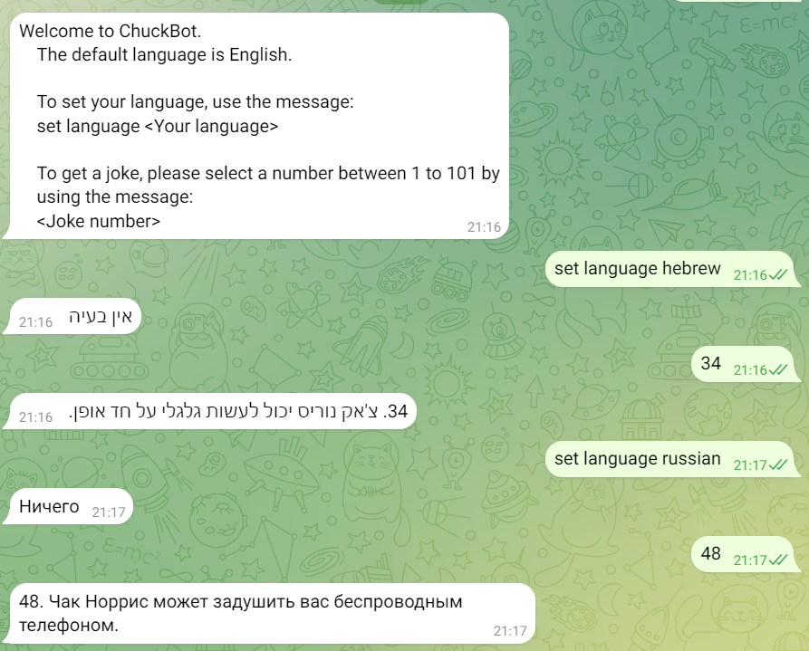

# ChuckBot 🤖
ChuckBot is a Telegram bot that provides Chuck Norris jokes to the user deployed on AWS EC2.
The bot uses the Azure Translation API to translate jokes into the selected language of the user.
Additionally, the bot employs web scraping to fetch jokes from the URL: [101 Chuck Norris Jokes To Make You Laugh](https://parade.com/968666/parade/chuck-norris-jokes/).

## Getting Started 🚀
For starting the chat with the bot on Telegram, click [here](https://t.me/ChuckJokes_Bot)
1. Start the chat with ChuckBot using the /start command
2. Set your preferred language using the command `set language <Your Language>`
3. Choose a joke by entering a number between 1 and 101 using the command `<Your Number>`

## Screenshots 📸

